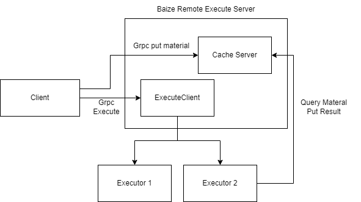

# BAIZE

[](https://pkg.go.dev/github.com/btwiuse/baize?tab=doc)
[](https://golang.org/dl/)
[](https://github.com/btwiuse/baize/blob/main/LICENSE)

<p align="center">
    <a href="https://github.com/btwiuse/baize" target="_blank">
        
    </a>
</p>

> Baize, mythical creatures in ancient Chinese mythology, who can speak with people, know every thing, 
> It considered to have psychic powers, and can wipe out all evil spirits in the world.

> Why use this name?
> Because it's pronunciation is very similar to [bazel](https://bazel.build/), which is open source by Google. And this project is related to bazel.

[中文](doc/README_zh.md)

## About

This project provide a minimum implement of [bazel remote execution](https://github.com/bazelbuild/remote-apis), can be used to learn how bazel remote execution works.

I also expect this project can be complete gradually, and can be used in the production environment. 

## Design


In shorts, Bazel Remote Executor exports two server for clients. 
1. Cache Server receives all materials, contains user src files, user action info, result of the action from executors, etc.
2. Execute Server can make the execution from users to Executors.

Cache Server has more than one backend. For small object, we use memory as backend;for medium object, we use seaweedfs as backend; for big object, we use oss.


Execute Server do actions from clients to executors.

## Development

modify codes in `cmd` and `pkg`, and run following script

```bash
./deploy/docker-compose/up.sh
```
